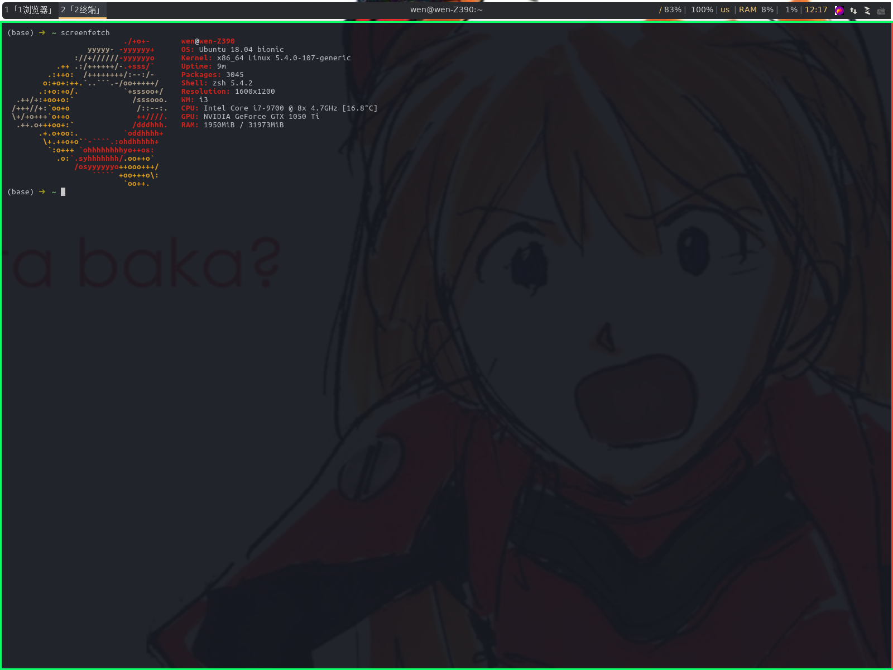

# i3wm_config
My i3wm configuration


## dependencies
- `flameshot` for screenshot.
- `feh` for auto setting background.
- `alacritty` for simulate terminate.
- `compton` for windows transpancy.
- `rofi` for open application convinently.

## usage
**caution** : this shell cript will overwrite your previous existing config.

```
sh ./install.sh
```

## feature
- Macos-like key, Swaped `Control` and `Alt`. 
- `Caps_Lock` + `hjkl` act as arrow `LEFT DOWN UP RIGHT` 
- More keybinding details can be find in `i3config`
- `Alt + Ctrl + a` for screen cut



## wallpaper
You can put your own wallpapers to `~/Pictures/feh_wallpapers/`.

